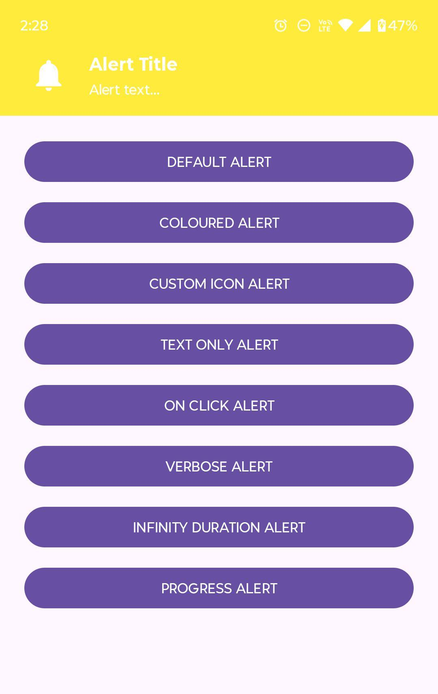
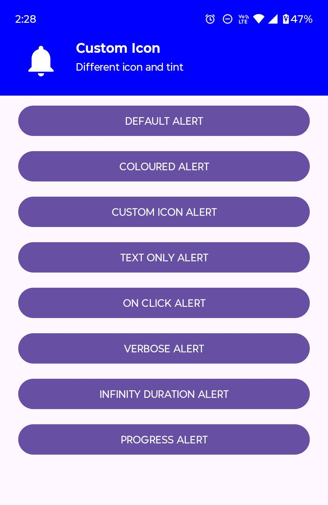
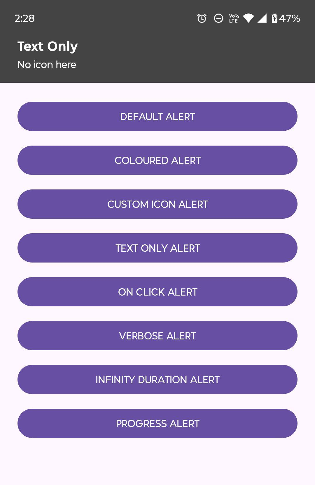
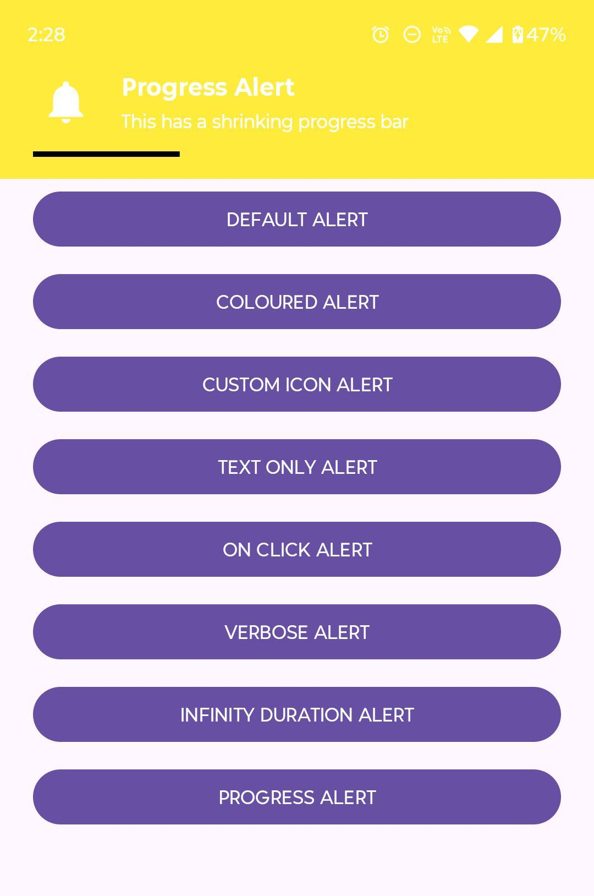
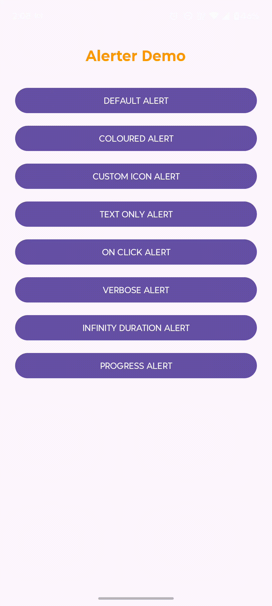

# Android Alerter – Top Sliding Alert Banner

[](https://kotlinlang.org/)
[](https://developer.android.com/about/versions/lollipop)
[](https://opensource.org/licenses/MIT)
[](#)

**Android Alerter** is a beautiful, lightweight, and highly customizable top-sliding alert banner library for Android. It displays elegant alerts that smoothly slide down from the top of the screen (similar to system notifications), fully respecting the status bar and display cutouts.

Perfect for success messages, warnings, info alerts, loading states, or any temporary notification without blocking the UI.

---

## 📸 Preview
| Default Alert | Colored + Custom Icon | Text Only | Progress Alert |
|---------------|-----------------------|-----------|----------------|
|  |  |  |  |

<div align="center">
  
</div>

---

## ✨ Features

- Slides down from the top of the screen (system notification style)
- Fully customizable: title, text, icon, colors, text sizes, background drawable
- Optional icon with tint and custom size
- Hide icon completely for text-only alerts
- Swipe-to-dismiss (upward swipe)
- Clickable with custom onClick listener
- Auto-dismiss with configurable duration
- Infinite duration mode (no auto-dismiss)
- Optional animated progress bar (shrinks right → left)
- Customizable progress bar color
- Respects status bar height and display cutout (notch-safe)
- Elegant show/hide animations with bounce effect
- Only one alert visible at a time (automatically hides previous)
- Show/hide callbacks
- Zero external dependencies – pure Android

---

## 📦 Installation

This library is designed as a single-file implementation for easy integration into any project.

**Step 1:** Add JitPack repository to your root `build.gradle` (or `settings.gradle`):

```gradle
allprojects {
    repositories {
        maven { url 'https://jitpack.io' }
    }
}
```

**Step 2:** Add dependency to your app module's `build.gradle`:

```gradle
dependencies {
    implementation 'com.github.yourusername:AndroidAlerter:1.0.0'
}
```


---

## 🚀 Usage

### Basic Alert

```kotlin
Alerter.create(this)
    .setTitle("Success")
    .setText("Operation completed successfully")
    .show()
```

### Fully Customized Alert

```kotlin
Alerter.create(this)
    .setTitle("Download Finished")
    .setText("File saved to Downloads")
    .setIcon(R.drawable.ic_download_done)
    .setIconTint(Color.WHITE)
    .setIconSize(60)
    .setBackgroundColor(Color.parseColor("#2E7D32"))
    .setTitleTextColor(Color.WHITE)
    .setTextColor(Color.parseColor("#C8E6C9"))
    .setTitleTextSize(20f)
    .setTextSize(15f)
    .setDuration(5000)
    .setOnClickListener {
        Toast.makeText(this, "Alert tapped!", Toast.LENGTH_SHORT).show()
        Alerter.hide()
    }
    .show()
```

### Special Alert Types

```kotlin
// Text-only (no icon)
Alerter.create(this)
    .setTitle("Warning")
    .setText("No internet connection")
    .hideIcon()
    .setBackgroundColor(Color.parseColor("#FF9800"))
    .show()

// Infinite duration (manual dismiss only)
Alerter.create(this)
    .setTitle("Live Feed")
    .setText("Receiving updates...")
    .enableInfiniteDuration(true)
    .show()

// Progress alert with custom progress color
Alerter.create(this)
    .setTitle("Uploading...")
    .setText("3 of 10 files")
    .enableProgress(true)
    .setProgressColor(Color.YELLOW)
    .setBackgroundColor(Color.parseColor("#1976D2"))
    .setDuration(6000)
    .show()
```

### Global Hide

```kotlin
Alerter.hide() // Immediately dismiss current alert
```

---

## 🔧 Available Methods

| Method                                   | Description                                      |
|------------------------------------------|--------------------------------------------------|
| `setTitle(text: String)`                 | Set alert title                                  |
| `setText(text: String)`                  | Set alert message text                           |
| `setIcon(@DrawableRes resId: Int)`       | Set icon from drawable resource                  |
| `hideIcon()`                             | Completely hide the icon                         |
| `setIconTint(@ColorInt color: Int)`      | Apply color tint to icon                         |
| `setIconSize(dp: Int)`                   | Set icon size in dp                              |
| `setBackgroundColor(@ColorInt color)`    | Set solid background color                       |
| `setBackgroundDrawable(drawable)`        | Set custom background drawable                   |
| `setTitleTextColor(color)`               | Title text color                                 |
| `setTextColor(color)`                    | Message text color                               |
| `setTitleTextSize(size: Float)`          | Title text size in sp                            |
| `setTextSize(size: Float)`               | Message text size in sp                          |
| `setDuration(millis: Long)`              | Auto-dismiss duration in milliseconds            |
| `enableInfiniteDuration(true)`           | Disable auto-dismiss                             |
| `enableProgress(true)`                   | Show animated progress bar at bottom              |
| `setProgressColor(@ColorInt color)`      | Custom color for progress bar                    |
| `setOnClickListener { ... }`             | Handle tap on alert                              |
| `setOnShowListener { ... }`              | Callback when alert appears                      |
| `setOnHideListener { ... }`              | Callback when alert disappears                   |
| `show()`                                 | Display the alert                                |

---

## 📄 License

```
MIT License

Copyright (c) 2025 Excelsior Technologies

Permission is hereby granted, free of charge, to any person obtaining a copy
of this software and associated documentation files (the "Software"), to deal
in the Software without restriction, including without limitation the rights
to use, copy, modify, merge, publish, distribute, sublicense, and/or sell
copies of the Software, and to permit persons to whom the Software is
furnished to do so, subject to the following conditions:

The above copyright notice and this permission notice shall be included in all
copies or substantial portions of the Software.

THE SOFTWARE IS PROVIDED "AS IS", WITHOUT WARRANTY OF ANY KIND, EXPRESS OR
IMPLIED, INCLUDING BUT NOT LIMITED TO THE WARRANTIES OF MERCHANTABILITY,
FITNESS FOR A PARTICULAR PURPOSE AND NONINFRINGEMENT. IN NO EVENT SHALL THE
AUTHORS OR COPYRIGHT HOLDERS BE LIABLE FOR ANY CLAIM, DAMAGES OR OTHER
LIABILITY, WHETHER IN AN ACTION OF CONTRACT, TORT OR OTHERWISE, ARISING FROM,
OUT OF OR IN CONNECTION WITH THE SOFTWARE OR THE USE OR OTHER DEALINGS IN THE
SOFTWARE.
```

---
